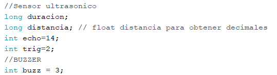

## Cinta transportadora

### Configuraciones del motor con driver
```C
#include <Stepper.h>

int stepsPerRevolution = 100;
int motSpeed = 4;
Stepper myStepper(stepsPerRevolution,10,11,12,13);
```

Para mover el motor con driver se utilizó la libreria **Stepper.h** que facilita bastante el control de los motores stepper. Para utilizarlo se necesitan de dos variables importantes, el primero es los pasos que da por cada revolucion y el segundo es la velocidad en que se mueve el motor.
Se debe de crear una instancia de la libreria Stepper.h ingresando los parametros de pasosPorRevolucion y los pines que controlaran al motor por medio del controlador **L293D**.


### Configuraciones para el motor sin diver
Para el motor sin driver se conectaron 4 pines directamente del Arduino al motor stepper para controlarlo. Estos se definieron el el archivo .ino junto con una variable que dentendra un breve tiempo la ejecucion para dar los pasos de forma correcta.


Luego de declarar los pines se deben inicializar en la parte del setup, indicando que serán pines de salida.


### Configuraciones para los motores DC y sus luces led
Para controlar los motores DC y las luces led que lo acompañan, primero se declararon los pines que cada uno de ellos utilizaron.


Luego de declarar los pines se debe indicar que serán pines de salida en la parte del setup.


### Configuraciones para el sensor ultrasonico y buzzer
Primero se declararon los pines que se utilizarían para cada uno de los dispositivos. Luego se indico en la parte del setup que define si los pines son de entrada o salida. Tambien se definen las variables que controlan los pulsos que manda el sensor ultrasonico y la distancia que recorre cada pulso




## Metodos para mover la cinta transportadora

### Recorrer posición
Para recorrer las posiciones por dond la cinta debe de pasar se primero se mueven los motores para simular el arrivo a la primera estacion, luego comienza a diferenciar los ciclos que se deben realizar dependiendo del tamaño del vaso que se seleccione, por cada ciclo (de 1 a 5) que se repita, el motor se moverá por 5 segundos hasta llegar a la siguiente estacion donde comprobará por medio de un if si la posicion del helado corresponde a la posicion del ciclo, si corresponde se prende una luz led y también comienza a girar el motor DC que simula que se esta sirviendo el helado. El motor y la led se deben de prender por 5 segundos para luego continuar con la siguiente estacion.
Este ciclo se repite dependiendo del tamaño del vaso que se desea comprar(una vez para el tamaño 1, 2 veces para el tamaño 2 y 3 veces para el tamaño 3).


Al finalizar este metodo se llama al método entregar para finalizar con la ejecución.

### Seleccionar DC
En este metodo se selecciona el motor DC que se activará dependiendo de la posicion en que se encuentre el ciclo, manteniendolo encendido por 5 segundos y luego se apaga.
Se utiliza la funcion millis() para medir el tiempo que se mantine encendido el motor y se evita el uso de delay que detiene la ejecución de todos los porcesos.


