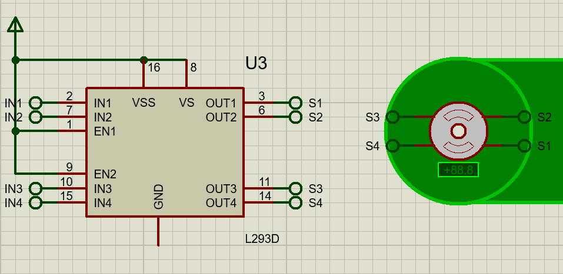
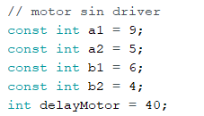
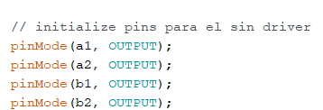
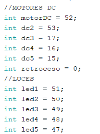
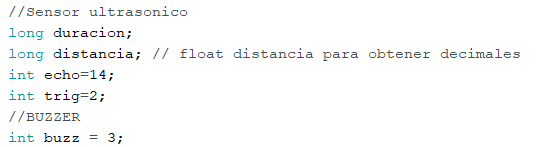
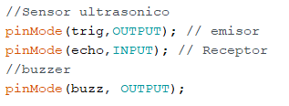
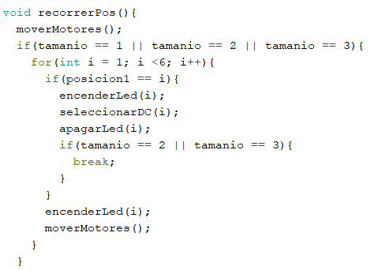
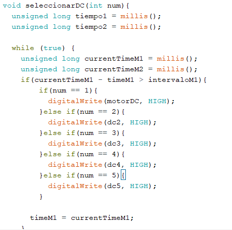

# [Manual Ténico]()
______

## Como Instalar Arduino

- For Windows
Debe de dirigirse a la [Página de arduino](https://www.arduino.cc/en/software) con el siguiente enlace.
___
## Metodos a Utilizar
____

### Arduino
Libería a Utilizar para EEPROM, encargada de almacenar tanto la cantidad de helados, como la cantidad de dinero recaudado, además de mostrar la temperatura ambiente; otra librería a implentar fue la de LiquidCrystal que sirve para la pantalla led; la librería keypad que sirve para manejar el teclado matricial.
```c++
/* Memoria EEPROM*/
#include <EEPROM.h>
/* Pantalla Led */
#include<LedControl.h>
#include <LiquidCrystal_I2C.h>
/* Teclado Matricial */
#include <Keypad.h>
```

Se define un pin para poder conectar el componente bluethoot; define un pin para poder conectar el sensor de temperatura.
```c++
/* bluetooth */
#define bluethoot 8
/* sensor de temperatura */
#define pinA1 1
```


Variables a utilizar para millis():
```c++
unsigned long time_matrix = 0;
unsigned long contador_1  = 0; 
```

Estructura para el teclado matricial
```c++
const byte matrix_row     = 4;
const byte matrix_column  = 3;
 
char keys[matrix_row][matrix_column] = {
   { '1','2','3'},
   { '4','5','6'},
   { '7','8','9'},
   { '*','0','#'}
};

/* PINES DE TECLADO MATRICIAL */
const byte matrix_row_pin[matrix_row]       = { 30, 31, 32, 33};
const byte matrix_column_pin[matrix_column] = { 34, 35, 36};
```


Utilizamos una variable float, para poder obtener el valor en °C.
```c++
/* Variables */
float temperature_C;
```

Para calcular la temperatura se uso está ecuación:
```c++
/* Temperatura */
temperature_C = analogRead(pinA1);                      // Leemos el sensor por medio de analogRead, se encuentra en un rango de 0 a 1023.
temperature_C = (5.0 * temperature_C * 100.0)/1024.0;   // Calculamos la temperatura con la fórmula.
MyStructValue.temperature = temperature_C;
```

Creación de Struct y Asignación.
```c++
/* Create Struct */
int eeAddress = 0;
struct MyStruct{
  int icecream0;
  int icecream1;
  int icecream2;
  int icecream3;
  int icecream4;
  float money;
  int temperature;
};

/* Assignment */
MyStruct MyStructValue = {10,10,10,10,10,0.0,20};
```


Iniciar Terminal y el componente HC06 - Bluetooth; además de agregar la configuración Inicial para la pantalla led.
```c++
void setup() {
  // put your setup code here, to run once:
  /** TERMINAL **/
  Serial.begin(9600);   // Terminal
  Serial1.begin(9600);  // Bluethooth

  /* EEPROM */
  EEPROM.put(eeAddress, MyStructValue);

  /* PANTALLA LED */
  lcd.begin(16,2);
  lcd.clear();
}

```

Comuniación entre Arduino y la APP, es la encargada de recibir por medio de un avilable, luego por medio de un read(); se puede obtener el dato recibido desde la app, que luego por medio de un Serial1.print(); se puede enviar datos a la app, en este caso se envio las cantidades de los helados, el dinero, y temeratura.

```c++
void loop() {
  // put your main code here, to run repeatedly:
  

  if (Serial1.available() > 0) {
      char readed = Serial1.read();

      if (readed == 'C'){ // conectar Bluethooth
       Serial.println("Bluethoot Conectado!"); 
      }else if (readed == 'U'){ // UPDATE
        Serial.println("Actualizando Datos");
        EEPROM.get(eeAddress, MyStructValue);     // getStruct
        boolean flag = false;
        if (MyStructValue.icecream0 == 0){ MyStructValue.icecream0 = 10; flag = true; }
        if (MyStructValue.icecream1 == 0){ MyStructValue.icecream1 = 10; flag = true; }
        if (MyStructValue.icecream2 == 0){ MyStructValue.icecream2 = 10; flag = true; }
        if (MyStructValue.icecream3 == 0){ MyStructValue.icecream3 = 10; flag = true; }
        if (MyStructValue.icecream4 == 0){ MyStructValue.icecream4 = 10; flag = true; }
        if (flag) { EEPROM.put(eeAddress, MyStructValue); flag = false; }
        Serial1.print(String(MyStructValue.icecream0));
        Serial1.print("|");
        Serial1.print(String(MyStructValue.icecream1));
        Serial1.print("|");
        Serial1.print(String(MyStructValue.icecream2));
        Serial1.print("|");
        Serial1.print(String(MyStructValue.icecream3));
        Serial1.print("|");
        Serial1.print(String(MyStructValue.icecream4));
        Serial1.print("|");
        Serial1.print(String(MyStructValue.money));
        Serial1.print("|");
        Serial1.print(String(MyStructValue.temperature));
        eeAddress = 0;
      }else if (readed == 'O') {
          digitalWrite(bluethoot, HIGH);
          EEPROM.get(eeAddress, MyStructValue);     // getStruct
          MyStructValue.icecream0--;
          EEPROM.put(eeAddress, MyStructValue); // reasigno datos 
          eeAddress += sizeof(MyStructValue);
          eeAddress = 0;
         
      } else if (readed == 'F'){
        digitalWrite(bluethoot, LOW);
      } 

  }

}
```

Metodo que es el encargado de obtener los datos del teclado matricial.
```c++
void metodoTeclado(){
   if (millis() > time_matrix + 10){
    time_matrix = millis();

    char key = keypad.getKey();
    if (key) {
      Serial.println(key);
    }
  }
}
```


Metodo encargado de mostrar el texto en la pantalla Led.
```c++
int getTeclado(){
   if (millis() > time_matrix + 10){
    time_matrix = millis();

    char key = keypad.getKey();
    if (key) {
      Serial.println(key);
      lcd.setCursor(14,1);
      lcd.print(key);
      choose_code(key);
      return int(key);
      
    }
  }
}
```
Metodo encargado de obtener el vaso que se desea seleccionar 
```c++
void getVaso(){
    
      if(bandera_vaso != true){
      lcd.clear();    
      }
      if(flag_vaso == 0 ){
        lcd.setCursor(1,0);
      lcd.print("seleccione el");
      lcd.setCursor(0,1);
      lcd.print("vaso:");
      bandera_vaso = true;
      delay(1000);
      }
      
    
    
    
  
  if(!precio_vaso_1){
    valor_vaso = getTeclado();
    
    postPrecioVaso(valor_vaso);
  }
  getTeclado();
  
}
```

Metodo encargado de enviar los datos seleccionados del vaso 
```c++
void postPrecioVaso(char x){
  if(!cerrar_vaso){
    bandera_precio_vaso = true;
  if(vaso_limpiar != true && flag_vaso==1){
    lcd.clear();
    vaso_limpiar=true;
  }
  
  switch (x){
        case '1':
          valor_vaso_definitivo =1 ;
          lcd.clear();
          lcd.setCursor(0,0);
          lcd.print(x);
          delay(1000);
          precio_vaso_1=true;
          lcd.clear();
          lcd.setCursor(1,0);
          lcd.print("precio: 20"); money_vaso = 20.0;
          cerrar_vaso= true;
          flag_vaso = 1;
          delay(1500);
          flag_choose_icecream=true ;
          lcd.clear();
          lcd.setCursor(0,0);
          lcd.print("Sabor No. " + String(cont_sabor));
          break;
        case '2':
          valor_vaso_definitivo =2 ;
          lcd.clear();
          lcd.setCursor(0,0);
          lcd.print(x);
          delay(1000);
          precio_vaso_1=true;
          lcd.clear();
          lcd.setCursor(1,0);
          lcd.print("precio: 30"); money_vaso = 30.0;
          flag_vaso = 1;
          delay(1500);
          cerrar_vaso= true;
          flag_choose_icecream=true ;
          lcd.clear();
          lcd.setCursor(0,0);
          lcd.print("Sabor No. " + String(cont_sabor));
          break;
        case '3':
          valor_vaso_definitivo = 3 ;
          lcd.clear();
          lcd.setCursor(0,0);
          lcd.print(x);
          delay(1000);
          precio_vaso_1=true;
          lcd.clear();
          lcd.setCursor(1,0);
          lcd.print("precio: 40"); money_vaso = 40.0;
          flag_vaso = 1;
          delay(1500);
          cerrar_vaso= true;
          flag_choose_icecream=true ;
          lcd.clear();
          lcd.setCursor(0,0);
          lcd.print("Sabor No. " + String(cont_sabor));
          break;
    }
  }
  
}
```

Metodo encargado de resetear todas las banderas para poder escoger un vaso de helado nuevamente 
```c++
void reset(){
      bandera_vaso = false ; 
    
    flag_vaso = 0 ;
    precio_vaso_1 = false ; 
    vaso_limpiar = false;
    
    cerrar_vaso = false ;
}
```
Metodo encargado de obtener el char seleccionado en el teclado 
```c++
void metodoMensaje(){
    
  if(millis()<contador_1+1500){
    if(mensaje != true){
      contador_1 = millis() + 1500;  
    }
       
    lcd.setCursor(0,0);
    lcd.print("Grupo 3");
    lcd.setCursor(2,1);
    lcd.print("Proyecto 1");
    mensaje = true;
  }else{
    if(millis()>contador_1){
      if(mensaje == true){
        lcd.clear();
        mensaje = false ; 
      }
      lcd.setCursor(2,1);
      metodoTeclado();
    }
  }
}
```
### SABORES
Metodo de choose code , para poder seleccionar el codigo que se esta escribiendo por medio del teclado 
```c++
void choose_code(char key){
  
  if (flag_choose_icecream){
    
    if (cont_code<2) {
      if(cont_code == 0){ lcd.clear(); }
      lcd.setCursor(0,0);
      lcd.print("Sabor No. " + String(cont_sabor));
      lcd.setCursor(cont_code,1);
      lcd.print(key);
      conca_matrix += String(key);
      cont_code++;
      
    } else {
      lcd.setCursor(cont_code,1);
      lcd.print(key);
      conca_matrix += String(key);
      cont_code=0;
      switch_code();
    }
  }
}
```
Metodo de Switch_code sirve para iniciliazar las concatenaciones 
```c++
void switch_code(){
  if(flag_choose_icecream){
    EEPROM.get(eeAddress, MyStructValue);
    switch(conca_matrix.toInt()){
      case 167: // sabor 1 
        if (MyStructValue.icecream0 == 0) {
          Serial.println("NO HAY EN INVENTARIO"); show_message_inventary_mistake();
        } else {
          MyStructValue.icecream0--; EEPROM.put(eeAddress, MyStructValue); // reasigno datos 
          if (cont_sabor == 1) { bola1 = conca_matrix.toInt();
            Serial.print("Bola 1: "); Serial.println(conca_matrix.toInt()); 
          }else if(cont_sabor == 2){ bola2 = conca_matrix.toInt();
            Serial.print("Bola 2: "); Serial.println(conca_matrix.toInt());
          }else if(cont_sabor == 3){ bola3 = conca_matrix.toInt();
            Serial.print("Bola 3: "); Serial.println(conca_matrix.toInt());;
          }
          Serial.println("HELADO 1: " + String(conca_matrix) + " | Stock: " + String(MyStructValue.icecream0)); cont_sabor++;
        }
        break;
      case 267: // sabor 2
        if (MyStructValue.icecream1 == 0) {
          Serial.println("NO HAY EN INVENTARIO"); show_message_inventary_mistake();
        } else {
          MyStructValue.icecream1--; EEPROM.put(eeAddress, MyStructValue); // reasigno datos 
          if (cont_sabor == 1) { bola1 = conca_matrix.toInt();
            Serial.print("Bola 1: "); Serial.println(conca_matrix.toInt()); 
          }else if(cont_sabor == 2){ bola2 = conca_matrix.toInt();
            Serial.print("Bola 2: "); Serial.println(conca_matrix.toInt());
          }else if(cont_sabor == 3){ bola3 = conca_matrix.toInt();
            Serial.print("Bola 3: "); Serial.println(conca_matrix.toInt());;
          }
          Serial.println("HELADO 2: " + String(conca_matrix) + " | Stock: " + String(MyStructValue.icecream1)); cont_sabor++;
          
        }
        break;
      case 367: // sabor 3
        if (MyStructValue.icecream2 == 0) {
          Serial.println("NO HAY EN INVENTARIO"); show_message_inventary_mistake();
        } else {
          MyStructValue.icecream2--; EEPROM.put(eeAddress, MyStructValue); // reasigno datos 
          if (cont_sabor == 1) { bola1 = conca_matrix.toInt();
            Serial.print("Bola 1: "); Serial.println(conca_matrix.toInt()); 
          }else if(cont_sabor == 2){ bola2 = conca_matrix.toInt();
            Serial.print("Bola 2: "); Serial.println(conca_matrix.toInt());
          }else if(cont_sabor == 3){ bola3 = conca_matrix.toInt();
            Serial.print("Bola 3: "); Serial.println(conca_matrix.toInt());;
          }
          Serial.println("HELADO 3: " + String(conca_matrix) + " | Stock: " + String(MyStructValue.icecream2)); cont_sabor++;
        }
        break;
      case 467: // sabor 4
        if (MyStructValue.icecream3 == 0) {
          Serial.println("NO HAY EN INVENTARIO"); show_message_inventary_mistake();
        } else {
          MyStructValue.icecream3--; EEPROM.put(eeAddress, MyStructValue); // reasigno datos 
          if (cont_sabor == 1) { bola1 = conca_matrix.toInt();
            Serial.print("Bola 1: "); Serial.println(conca_matrix.toInt()); 
          }else if(cont_sabor == 2){ bola2 = conca_matrix.toInt();
            Serial.print("Bola 2: "); Serial.println(conca_matrix.toInt());
          }else if(cont_sabor == 3){ bola3 = conca_matrix.toInt();
            Serial.print("Bola 3: "); Serial.println(conca_matrix.toInt());;
          }
          Serial.println("HELADO 4: " + String(conca_matrix) + " | Stock: " + String(MyStructValue.icecream3)); cont_sabor++;
        }
        break;
      case 567: // sabor 5
        if (MyStructValue.icecream4 == 0) {
          Serial.println("NO HAY EN INVENTARIO"); show_message_inventary_mistake();
        } else {
          MyStructValue.icecream4--; EEPROM.put(eeAddress, MyStructValue); // reasigno datos 
          if (cont_sabor == 1) { bola1 = conca_matrix.toInt();
            Serial.print("Bola 1: "); Serial.println(conca_matrix.toInt()); 
          }else if(cont_sabor == 2){ bola2 = conca_matrix.toInt();
            Serial.print("Bola 2: "); Serial.println(conca_matrix.toInt());
          }else if(cont_sabor == 3){ bola3 = conca_matrix.toInt();
            Serial.print("Bola 3: "); Serial.println(conca_matrix.toInt());;
          }
          Serial.println("HELADO 5: " + String(conca_matrix) + " | Stock: " + String(MyStructValue.icecream4)); cont_sabor++;
        }
        break;
      default:
        show_message_code_mistake();
        break;
    }
  }
  
  conca_matrix = "";
  delay(1000);
  lcd.clear();

  if (valor_vaso_definitivo < cont_sabor) {   
    cont_sabor = 1;
    flag_choose_icecream=false ;
    
    Serial.println("Precio: " + String(money_vaso));
    EEPROM.get(eeAddress, MyStructValue); MyStructValue.money += money_vaso; EEPROM.put(eeAddress, MyStructValue); 
    money_vaso = 0.0;
    tamanio = valor_vaso_definitivo;
    Serial.println("Bola 1: " + String(bola1));
    Serial.println("Bola 2: " + String(bola2));
    Serial.println("Bola 3: " + String(bola3));
    Serial.println("Tam: " + String(valor_vaso_definitivo));
    servirHelado();
    valor_vaso_definitivo = 0;
    if(precio_vaso_1){
      reset();
    }
    
  } else {
      lcd.setCursor(0,0);
      lcd.print("Sabor No. " + String(cont_sabor));
    
  }
  
}


```

Mostrar Error de codigo de helado 
```c++
void show_message_code_mistake(){
  Serial.println("Codigo de Sabor: " + String(conca_matrix));
  lcd.setCursor(0,0);
  lcd.print("NO EXISTE ESE");
  lcd.setCursor(0,1);
  lcd.print("CODIGO DE SABOR");
}
```

Mostrar mensaje de falta de inventario de helado 
```c++
void show_message_inventary_mistake(){
  Serial.println("NO HAY STOCK");
  lcd.setCursor(0,0);
  lcd.print("NO HAY STOCK");
  lcd.setCursor(0,1);
  lcd.print("DE ESE SABOR");
}

```
### APP

La app fue desarrolada en [MIT App Inventor](https://appinventor.mit.edu/)

Declaracion de variables, para la lista y otros condiciones.


Se inicio conectado por medio de bloques el bluetooth
Diseño en proteus.


Luego se por medio de un boton se puede conectar al bluetooth


Ademásse agrego un boton que permite desconectar al bluetooth.


Se creo un boton encargado de actualizar los datos de la APP.


Para poder recibir los datos se hizo la siguiente estructura, que es la encarga de recibir de arduino a app, primero se guarda en un texto, que por consigueinte, es separada por un split, separada por "|" y es guardada en la lista, que es recorrida desde la posición 1 hasta la 7.


## Cinta transportadora

### Configuraciones del motor con driver
```C
#include <Stepper.h>

int stepsPerRevolution = 100;
int motSpeed = 4;
Stepper myStepper(stepsPerRevolution,10,11,12,13);
```

Para mover el motor con driver se utilizó la libreria **Stepper.h** que facilita bastante el control de los motores stepper. Para utilizarlo se necesitan de dos variables importantes, el primero es los pasos que da por cada revolucion y el segundo es la velocidad en que se mueve el motor.
Se debe de crear una instancia de la libreria Stepper.h ingresando los parametros de pasosPorRevolucion y los pines que controlaran al motor por medio del controlador **L293D**.



### Configuraciones para el motor sin diver
Para el motor sin driver se conectaron 4 pines directamente del Arduino al motor stepper para controlarlo. Estos se definieron el el archivo .ino junto con una variable que dentendra un breve tiempo la ejecucion para dar los pasos de forma correcta.



Luego de declarar los pines se deben inicializar en la parte del setup, indicando que serán pines de salida.



### Configuraciones para los motores DC y sus luces led
Para controlar los motores DC y las luces led que lo acompañan, primero se declararon los pines que cada uno de ellos utilizaron.



Luego de declarar los pines se debe indicar que serán pines de salida en la parte del setup.


### Configuraciones para el sensor ultrasonico y buzzer
Primero se declararon los pines que se utilizarían para cada uno de los dispositivos. Luego se indico en la parte del setup que define si los pines son de entrada o salida. Tambien se definen las variables que controlan los pulsos que manda el sensor ultrasonico y la distancia que recorre cada pulso





## Metodos para mover la cinta transportadora

### Recorrer posición
Para recorrer las posiciones por dond la cinta debe de pasar se primero se mueven los motores para simular el arrivo a la primera estacion, luego comienza a diferenciar los ciclos que se deben realizar dependiendo del tamaño del vaso que se seleccione, por cada ciclo (de 1 a 5) que se repita, el motor se moverá por 5 segundos hasta llegar a la siguiente estacion donde comprobará por medio de un if si la posicion del helado corresponde a la posicion del ciclo, si corresponde se prende una luz led y también comienza a girar el motor DC que simula que se esta sirviendo el helado. El motor y la led se deben de prender por 5 segundos para luego continuar con la siguiente estacion.
Este ciclo se repite dependiendo del tamaño del vaso que se desea comprar(una vez para el tamaño 1, 2 veces para el tamaño 2 y 3 veces para el tamaño 3).



Al finalizar este metodo se llama al método entregar para finalizar con la ejecución.

### Seleccionar DC
En este metodo se selecciona el motor DC que se activará dependiendo de la posicion en que se encuentre el ciclo, manteniendolo encendido por 5 segundos y luego se apaga.
Se utiliza la funcion millis() para medir el tiempo que se mantine encendido el motor y se evita el uso de delay que detiene la ejecución de todos los porcesos.



### Encender led
Este método enciende el pin de arduino dependiendo del valor que reciba como parametro, con el método digitalWrite que recibe como parametro el numero del pin de arduino y el estado que le asignamos ya sea high o low.

```C
void encenderLed(int num){
  if(num == 1){
    digitalWrite(led1, HIGH);
  }else if(num == 2){
    digitalWrite(led2, HIGH);
  }else if(num == 3){
    digitalWrite(led3, HIGH);
  }else if(num == 4){
    digitalWrite(led4, HIGH);
  }else if(num == 5){
    digitalWrite(led5, HIGH);
  }
}
```

### Apagar led
Este método apaga un pin digital de arduino dependiendo del numero que reciba como parametro, con em metodo digitalWrite pasandole como parametro el número del pin y el estado que deseamos.

```C
void apagarLed(int num){
  if(num == 1){
    digitalWrite(led1, LOW);
  }else if(num == 2){
    digitalWrite(led2, LOW);
  }else if(num == 3){
    digitalWrite(led3, LOW);
  }else if(num == 4){
    digitalWrite(led4, LOW);
  }else if(num == 5){
    digitalWrite(led5, LOW);
  }
}
```

### Retroceso de motores
Este metodo se utiliza para mover los motores en reversa, utilizando la función millis() para poder mover los dos motores a la vez por 5 segundos. 
Recibe como parametro un numero que es el identificador de la led por el cual esta pasando mientras retrocede. Al ejecutarse por 5 segundos se detiene el ciclo y continua con las siguientes instrucciones.

```C
void moverMotoresRetroceso(int num){
  unsigned long tiempo1 = millis();
  unsigned long tiempo2 = millis();

  while (true) {
    unsigned long currentTimeM1 = millis();
    unsigned long currentTimeM2 = millis();
    if(currentTimeM1 - timeM1 > intervaloM1){
      myStepper.step(-motSpeed);
      timeM1 = currentTimeM1;
    }
  
    if(currentTimeM2 - timeM2 > intervaloM2){
      funcionMotorRetroceso();
      timeM2 = currentTimeM2;
    }

    tiempo1 = millis();
    if (tiempo1 >= (tiempo2 + 5000)) {
      tiempo1 = 0;
      break;
    }
    if (tiempo1 >= (tiempo2 + 4000)) {
      encenderLed(num);
    }
  }
}
```

### Mover motores
Este metodo se utiliza para mover los motores hacia adelante, haciendo uso de la función millis() para poder mover los dos motores a la vez por 5 segundos.
Cuando ha pasado 1 segundo todas las luces led de los motores DC se apagan.

```C
void moverMotores(){  
  unsigned long tiempo1 = millis();
  unsigned long tiempo2 = millis();

  while (true) {
    unsigned long currentTimeM1 = millis();
    unsigned long currentTimeM2 = millis();
    if(currentTimeM1 - timeM1 > intervaloM1){
      myStepper.step(motSpeed);
      timeM1 = currentTimeM1;
    }
  
    if(currentTimeM2 - timeM2 > intervaloM2){
      funcionMotor();
      timeM2 = currentTimeM2;
    }

    tiempo1 = millis();
    if (tiempo1 >= (tiempo2 + 5000)) {
      tiempo1 = 0;
      break;
    }
    if (tiempo1 >= (tiempo2 + 1000)) {
      apagarLed2();
    }
  }
}
```

### Pasos para el retroceso del motor
En este método se ejecutan los pasos necesarios para que el motor sin controlador sea capaz de moverse, ejecutando un pequeño delay entre cada paso para que se realice cada una de las acciones.
```C
void funcionMotorRetroceso(){
  step4();
  delay(delayMotor);
  step2();
  delay(delayMotor);
  step3();
  delay(delayMotor);
  step1();
  delay(delayMotor);
  step4();
  delay(delayMotor);
  step2();
  delay(delayMotor);
  step3();
  delay(delayMotor);
  step1();
  delay(delayMotor);
}
```

### Servir helado
En este método se analiza cada una de las variables para controlar el recorrido del helado por la cinta transportadora. Se analiza el codigo y se le asigna la posicion hasta la cual debera avanzar cuando se encuentre recorriendo la cinta, si el tamaño es de 3 se asignan hasta 3 posiciones.
Al finalizar este metodo se ejecuta el método recorrerPos() para comenzar a mover la cinta.

```C
void servirHelado(){
  if(tamanio == 1){
    if (bola1 == codH1){
      posicion1 = 1;
    }else if (bola1 == codH2){
      posicion1 = 2;
    }else if(bola1 == codH3){
      posicion1 = 3;
    }else if(bola1 == codH4){
      posicion1 = 4;
    }else if(bola1 == codH5){
      posicion1 = 5;
    }
    posicion2 = 0;
    posicion3 = 0;
  }
  if(tamanio == 2){
    if (bola1 == codH1){
      posicion1 = 1;
    }else if (bola1 == codH2){
      posicion1 = 2;
    }else if(bola1 == codH3){
      posicion1 = 3;
    }else if(bola1 == codH4){
      posicion1 = 4;
    }else if(bola1 == codH5){
      posicion1 = 5;
    }

    if (bola2 == codH1){
      posicion2 = 1;
    }else if (bola2 == codH2){
      posicion2 = 2;
    }else if(bola2 == codH3){
      posicion2 = 3;
    }else if(bola2 == codH4){
      posicion2 = 4;
    }else if(bola2 == codH5){
      posicion2 = 5;
    }
    posicion3 = 0;
  }

  if(tamanio == 3){
    if (bola1 == codH1){
      posicion1 = 1;
    }else if (bola1 == codH2){
      posicion1 = 2;
    }else if(bola1 == codH3){
      posicion1 = 3;
    }else if(bola1 == codH4){
      posicion1 = 4;
    }else if(bola1 == codH5){
      posicion1 = 5;
    }

    if (bola2 == codH1){
      posicion2 = 1;
    }else if (bola2 == codH2){
      posicion2 = 2;
    }else if(bola2 == codH3){
      posicion2 = 3;
    }else if(bola2 == codH4){
      posicion2 = 4;
    }else if(bola2 == codH5){
      posicion2 = 5;
    }

    if (bola3 == codH1){
      posicion3 = 1;
    }else if (bola3 == codH2){
      posicion3 = 2;
    }else if(bola3 == codH3){
      posicion3 = 3;
    }else if(bola3 == codH4){
      posicion3 = 4;
    }else if(bola3 == codH5){
      posicion3 = 5;
    }
  }
  recorrerPos();
}

```

### Mover motor
Para mover el motor stepper sin controlador se ejecutarn cada uno de los pasos necesarios para que sea capaz de dar una vuelta, también ejecuta un delay entre cada paso para que no sucedan errores.

```C
void funcionMotor()
{
  step1();
  delay(delayMotor);
  step3();
  delay(delayMotor);
  step2();
  delay(delayMotor);
  step4();
  delay(delayMotor);
  step1();
  delay(delayMotor);
  step3();
  delay(delayMotor);
  step2();
  delay(delayMotor);
  step4();
  delay(delayMotor);
}
```

### Pasos para el motor sin driver
En cada uno de los pasos que el motor da se activa un pin y los demas pines del motor se mantienen apagados, en este caso se utilizaron 4 pasos para poder mover cada uno de los pines y asi girar el motor.

```C
void step1()
{
  digitalWrite(a1, HIGH);
  digitalWrite(a2, LOW);
  digitalWrite(b1, LOW);
  digitalWrite(b2, LOW);
}

void step2()
{
  digitalWrite(a1, LOW);
  digitalWrite(a2, LOW);
  digitalWrite(b1, HIGH);
  digitalWrite(b2, LOW);
}

void step3()
{
  digitalWrite(a1, LOW);
  digitalWrite(a2, HIGH);
  digitalWrite(b1, LOW);
  digitalWrite(b2, LOW);
}

void step4()
{
  digitalWrite(a1, LOW);
  digitalWrite(a2, LOW);
  digitalWrite(b1, LOW);
  digitalWrite(b2, HIGH);
}
```

### Entregar
El método entregar utiliza la función millis() para poder ejecutar dos instrucciones a la vez, en la primera se activa el sensor ultrasonico para medir la distancia que tiene del vaso y la segunda parte se utiliza para mover los motores de la cinta transportadora mientras el helado no se acerque lo suficiente.
Cuando la distancia sea menor a 200 centimetros se activa el buzzer para alertar al usuario de que el helado llegó al final de la cinta y no se detiene hasta que el sensor detecte que se ha retirado el helado aumentando la distancia a mayor a 200.
Al detectar que se retiró el helado se detiene el buzzer y se muestra un mensaje en la pantalla lcd indicando que fue concluido el servicio.

```C
void entregar(){
  unsigned long tiempo1 = millis();
  unsigned long tiempo2 = millis();

  while (true) {
    unsigned long currentTimeM1 = millis();
    unsigned long currentTimeM2 = millis();
    if(currentTimeM1 - timeM1 > intervaloM1){
      obtenerDistancia();
      timeM1 = currentTimeM1;
    }
  
    if(currentTimeM2 - timeM2 > intervaloM2 && distancia > 200){
      moverMotores();
      timeM2 = currentTimeM2;
    }

    tiempo1 = millis();
    if (distancia < 200) {
      tiempo1 = 0;
      while(distancia < 200){
        tone(buzz, 1000,500);  //1000hz
        //temporizador(1);
        //noTone(buzz);
        obtenerDistancia();
      }
      noTone(buzz);
      break;
    }
  }
}
```

### Obtener distancia
Para obtener la distancia a la que se encuentra el helado se utiliza el sensor ultrasonico.
Primero se activa el triguer que lanza un pulso que luego es leido por el pin echo, con la funcion pulseIn se detecta lo que tardo la onda en chocar contra un objeto y regresar al sensor. Para finalizar la duración se divide dentro de 58.4 y se obtiene la distancia en cm.

```C
void obtenerDistancia(){
  //Para estabilizar nuestro módulo ultrasónico
  digitalWrite(trig,LOW);
  delayMicroseconds(4);
  //disparo de un pulso en el trigger de longitud 10us
  digitalWrite(trig,HIGH);
  delayMicroseconds(10);
  digitalWrite(trig,LOW);

  //Lectura de la duración del pulso HIGH generado hasta recibir el Echo
  duracion=pulseIn(echo,HIGH);

  //Calculo distancia
  distancia=duracion/58.4;// (cm)
}
```