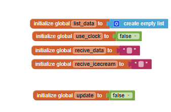
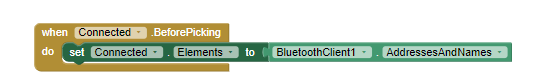

# [Manual Ténico - APP]()
______

## Como Instalar Arduino

- For Windows
Debe de dirigirse a la Página de arduino con el siguiente enlace.
https://www.arduino.cc/en/software


___
## Metodos a Utilizar
____

### Arduino
Libería a Utilizar para EEPROM, encargada de almacenar tanto la cantidad de helados, como la cantidad de dinero recaudado, además de mostrar la temperatura ambiente.
```c++
#include <EEPROM.h>
```

Se define un pin para poder conectar el componente bluethoot.
```c++
/* bluetooth */
#define bluethoot 8
```

Se define un pin para poder conectar el sensor de temperatura.
```c++
/* sensor de temperatura */
#define pinA1 1
```

Utilizamos una variable float, para poder obtener el valor en °C.
```c++
/* Variables */
float temperature_C;
```

Para calcular la temperatura se uso está ecuación:
```c++
/* Temperatura */
temperature_C = analogRead(pinA1);                      // Leemos el sensor por medio de analogRead, se encuentra en un rango de 0 a 1023.
temperature_C = (5.0 * temperature_C * 100.0)/1024.0;   // Calculamos la temperatura con la fórmula.
MyStructValue.temperature = temperature_C;
```

Creación de Struct y Asignación.
```c++
/* Create Struct */
int eeAddress = 0;
struct MyStruct{
  int icecream0;
  int icecream1;
  int icecream2;
  int icecream3;
  int icecream4;
  float money;
  int temperature;
};

/* Assignment */
MyStruct MyStructValue = {10,10,10,10,10,0.0,20};
```


Iniciar Terminal y el componente HC06 - Bluetooth
```c++
void setup() {
  // put your setup code here, to run once:
  /** TERMINAL **/
  Serial.begin(9600);   // Terminal
  Serial1.begin(9600);  // Bluethooth

  /* EEPROM */
  EEPROM.put(eeAddress, MyStructValue);
}

```

Comuniación entre Arduino y la APP, es la encargada de recibir por medio de un avilable, luego por medio de un read(); se puede obtener el dato recibido desde la app, que luego por medio de un Serial1.print(); se puede enviar datos a la app, en este caso se envio las cantidades de los helados, el dinero, y temeratura.

```c++
void loop() {
  // put your main code here, to run repeatedly:
  

  if (Serial1.available() > 0) {
      char readed = Serial1.read();

      if (readed == 'C'){ // conectar Bluethooth
       Serial.println("Bluethoot Conectado!"); 
      }else if (readed == 'U'){ // UPDATE
        Serial.println("Actualizando Datos");
        EEPROM.get(eeAddress, MyStructValue);     // getStruct
        boolean flag = false;
        if (MyStructValue.icecream0 == 0){ MyStructValue.icecream0 = 10; flag = true; }
        if (MyStructValue.icecream1 == 0){ MyStructValue.icecream1 = 10; flag = true; }
        if (MyStructValue.icecream2 == 0){ MyStructValue.icecream2 = 10; flag = true; }
        if (MyStructValue.icecream3 == 0){ MyStructValue.icecream3 = 10; flag = true; }
        if (MyStructValue.icecream4 == 0){ MyStructValue.icecream4 = 10; flag = true; }
        if (flag) { EEPROM.put(eeAddress, MyStructValue); flag = false; }
        Serial1.print(String(MyStructValue.icecream0));
        Serial1.print("|");
        Serial1.print(String(MyStructValue.icecream1));
        Serial1.print("|");
        Serial1.print(String(MyStructValue.icecream2));
        Serial1.print("|");
        Serial1.print(String(MyStructValue.icecream3));
        Serial1.print("|");
        Serial1.print(String(MyStructValue.icecream4));
        Serial1.print("|");
        Serial1.print(String(MyStructValue.money));
        Serial1.print("|");
        Serial1.print(String(MyStructValue.temperature));
        eeAddress = 0;
      }else if (readed == 'O') {
          digitalWrite(bluethoot, HIGH);
          EEPROM.get(eeAddress, MyStructValue);     // getStruct
          MyStructValue.icecream0--;
          EEPROM.put(eeAddress, MyStructValue); // reasigno datos 
          eeAddress += sizeof(MyStructValue);
          eeAddress = 0;
         
      } else if (readed == 'F'){
        digitalWrite(bluethoot, LOW);
      } 

  }

}
```


### APP

La app fue desarrolada en [MIT App Inventor](https://appinventor.mit.edu/)

Declaracion de variables, para la lista y otros condiciones.



Se inicio conectado por medio de bloques el bluetooth
Diseño en proteus.


Luego se por medio de un boton se puede conectar al bluetooth


Ademásse agrego un boton que permite desconectar al bluetooth.


Se creo un boton encargado de actualizar los datos de la APP.


Para poder recibir los datos se hizo la siguiente estructura, que es la encarga de recibir de arduino a app, primero se guarda en un texto, que por consigueinte, es separada por un split, separada por "|" y es guardada en la lista, que es recorrida desde la posición 1 hasta la 7.


