_____

## Diseño
_____
### Proteus
Diseño en proteus.
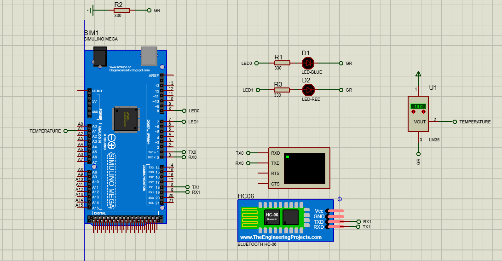

Terminal
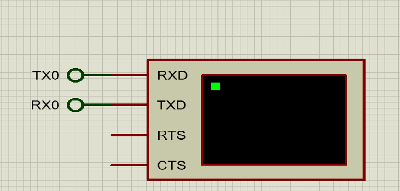

Componente que se utilizo para el Bluetooth
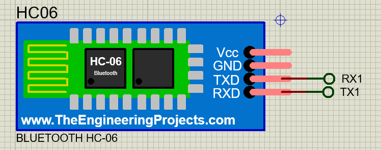

____
### App

Diseño de la APP
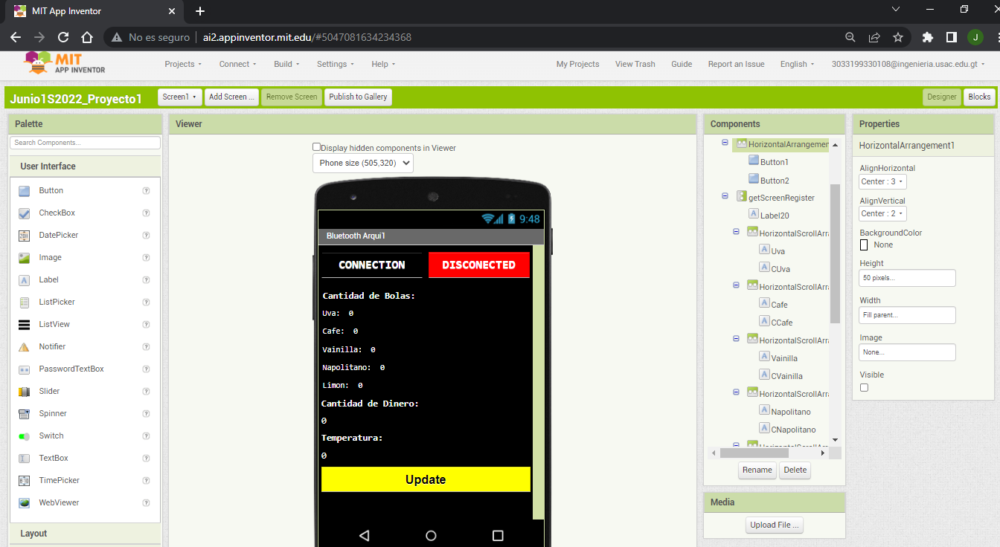

Parte para codificar en al APP
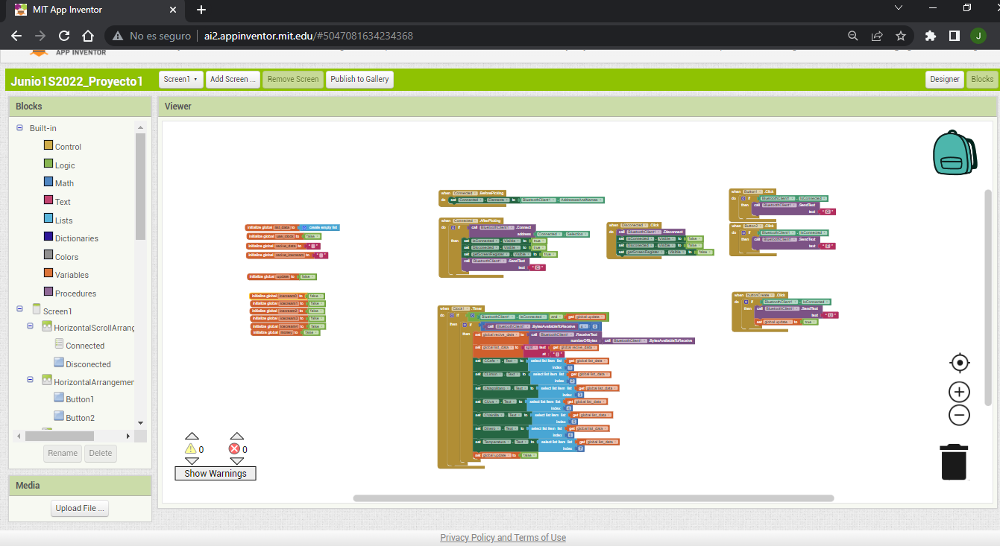
____
### Teclado y Pantalla LCD 

#### Interfaz General de el circuito 
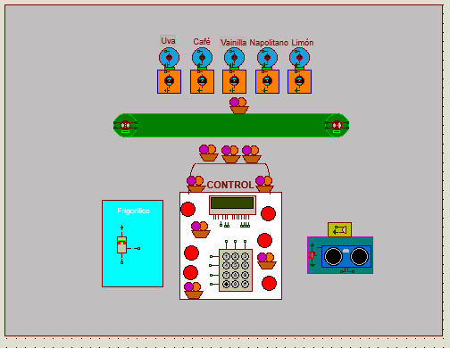
#### Mensaje inicial al iniciar la aplicacion 
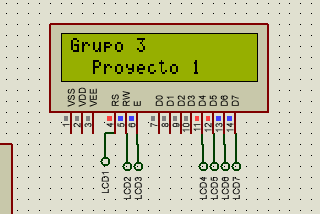
#### Al pasar 5 segundos se podra seleccionar el vaso seleccionado existiendo la posibilidad de ecoger entre 3 vasos del 1 al 3 si no es ninguno de estos generara un error y lo devolvera al mensaje de inicio 
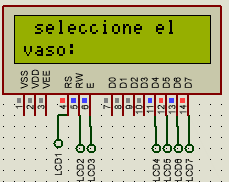
#### Al seleccionar el vaso se mostrara por un breve tiempo el valor de este vaso y se procedera a seleccionar los sabores 
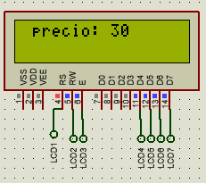
#### los sabores podran ser seleccionados por medio de un codigo de 3 numeros para cada sabor , estos podran ser escogidos dependiendo del vaso que se haya seleccionado con anterioridad permitiendo seleccionar hasta 3 diferentes abores con el vaso 3 
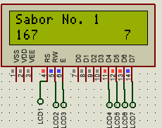

## Cinta transportadora
Luego de seleccionar el tamaño del helado lo los sabores que desea, la cinta transportadora comienza a moverse hacia el primer sabor de helado, al pasar por cada sabor se enciende la luz led sobre los motores DC para indicar que el helado va pasando por esa posicion.

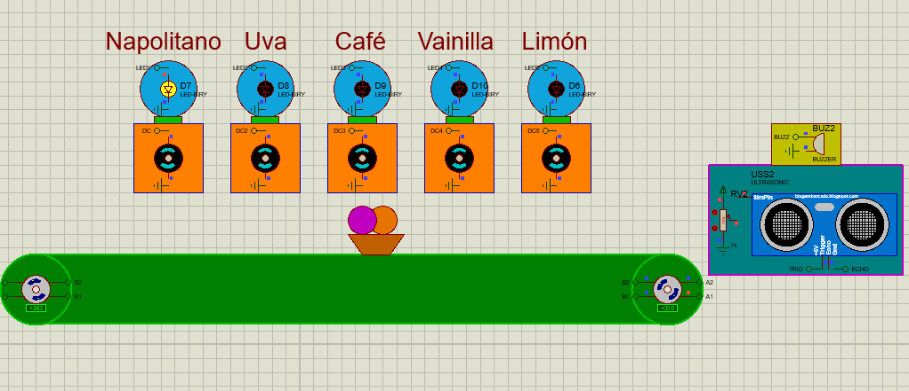

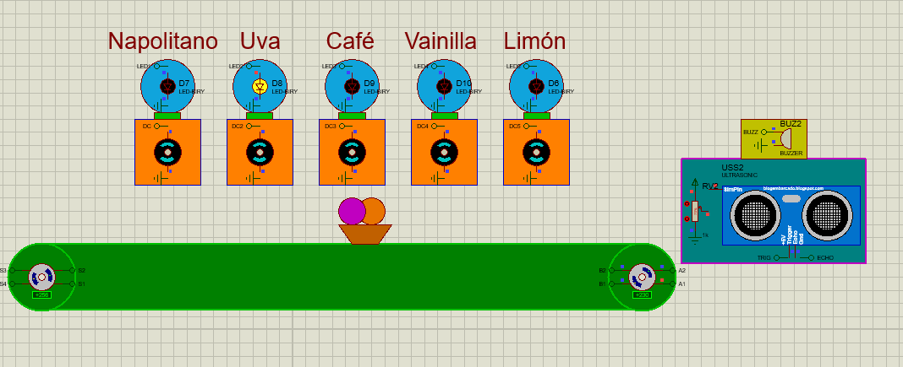

Al llegar a la posicion del helado que seleccionó el usuarion la cinta se detiene y el motor DC del sabor comienza a girar por 5 segundos para simular que se está sirviendo el helado, la luz led que se encuentra sobre el motor tambien se activa mientras el motor se mueve.

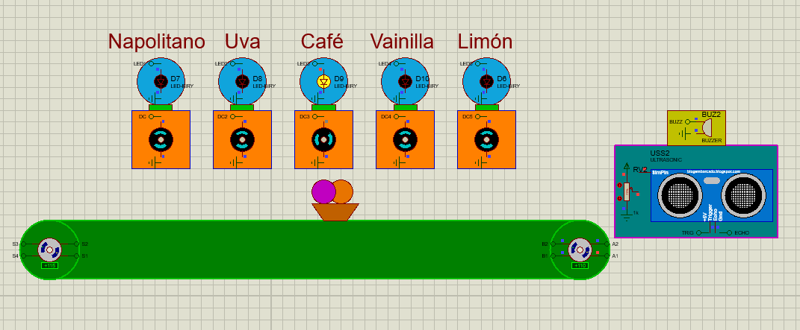

También es posible que la cinta retroceda hacia un sabor por el cual ya pasó, en este caso tambien se prenderá las luces por donde va pasando el helado hasta llegar al que el usuario selecciono para mover el motor DC simulando que el helado se esta sirviendo.

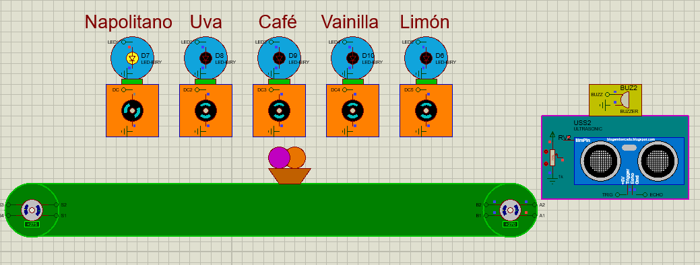

Al pasar por las 5 estaciones del helado y llegar al final de la cinta transportadora, el vaso se encuentra con un sensor ultrasonico que detecta la distancia a la que se encuentra, si la distancia es menor a 200 cm se detienen los motores de la cinta y se produce una alarma con el buzzer para indicarle al usuario que el servicio ha finalizado.
Con proteus se simula que la distancia es menor a 200 moviendo el potenciómetro a un valor menor a 15% lo que dará a entender que el vaso llego al final. Para detener la alarma del buzzer se tiene que retirar el vaso de la cinta transportadora, para eso se modifica nuevamente el valor del potenciómetro a un valor mayor al 20%, al hacer esto la alarma dejara de sonar y el sistema volverá a iniciar solicitandole de nuevo al usuario que seleccione el tamaño del helado que desea.

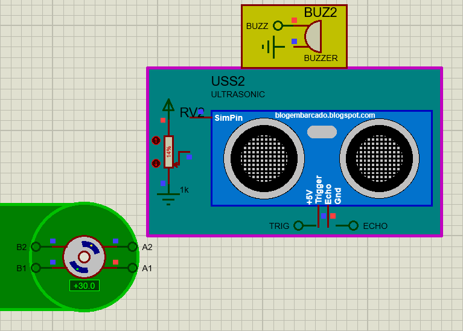

Para apagar el buzzer simulamor que se retira el vaso aumentando el varlor del potenciómetro.

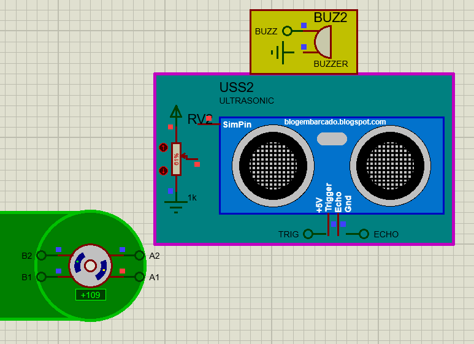

Al hacer esto el programa vuelve a solicitarle al usuario un nuevo tamaño de helado y los sabores correspondientes a dicho tamaño. Volviendo a iniciar todo el sistema de nuevo.

Se puede escoger cualquier combinacion de sabores, desde 3 del mismo sabor o diferentes en diferente orden a las que aparecen en la cinta.